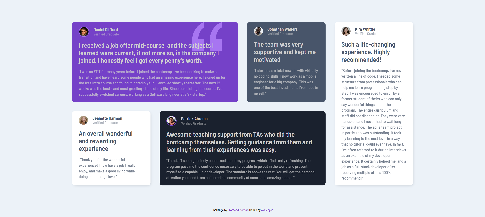

# Frontend Mentor - Testimonials Grid Section Solution

This is a solution to the [testimonials grid section challenge on frontend mentor](https://www.frontendmentor.io/challenges/testimonials-grid-section-Nnw6J7Un7). Frontend Mentor challenges help you improve your coding skills by building realistic projects.

## Table of contents

- [Overview](#overview)
  - [Screenshot](#screenshot)
  - [Links](#links)
- [My process](#my-process)
  - [Built with](#built-with)
- [Author](#author)

## Overview

### Screenshot

### Links

- Solution URL: [Testimonials Grid Section](https://www.frontendmentor.io/solutions/huddle-landing-page-with-a-single-introductory-section-qM3fXA8eq0)

## My process

### Built with

- Semantic HTML5 markup
- CSS custom properties
- Google Fonts
- Normalize.css

## Author

- Frontend Mentor - [@AyaZayed](https://www.frontendmentor.io/profile/AyaZayed)
- Linkedin - [Aya Zayed](https://www.linkedin.com/in/aya-zayed-2000/)
